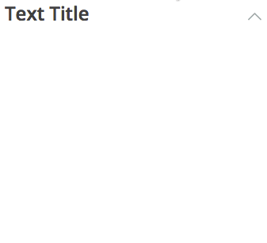

MILTextExpander
===============

<p align="center">
</p>

MILTextExpander is a reusable UI component written as an AngularJS directive, which defines a __text expander__ HTML element. The text expander creates a section of text that can smoothly appear or disappear when the header is clicked. An additional icon can be specified for the right of the header as well, with optional rotation when the text is revealed.

## Installation

Include the .js file in the `head` of the HTML file where the AngularJS controller is being applied.

```html
<script src="[path to file]/text-expander.js"></script>
```

Also include the `MILTextExpander` module as a dependency when defining your AngularJS module.

```js
angular.module('myModule', ['MILTextExpander']);
```

## Usage

The text expander can be inserted into an HTML document as in the example below:

```html
<text-expander title="Text Title" text="Lorem ipsum" button-image="arrow-button.jpg" button-rotation="90" />
```

* `title` - This parameter specifies the text to be displayed in the header.
* `text` - This parameter specifies the text to be displayed in the body.
* `button-image` - This optional parameter specifies an image to be displayed on the right side of the header.
* `button-rotation` - This optional parameter specifies the number of degrees the `button-image` will rotate when the text is revealed. The default value is 0 degrees. Positive values indicate a clockwise rotation; negative values indicate a counterclockwise rotation.

The text expander can be simply styled by making changes to the class `titleText` for the header, `detailsText` for the main text box, or `expandButton` for the optional header image. For more significant style adjustments, especially to the animation itself, modifying the directive template itself is recommended. Refer to the AngularJS documentation for [animations](https://docs.angularjs.org/guide/animations) and [ngAnimate](https://docs.angularjs.org/api/ngAnimate) for more information.

## Requirements

`MILTextExpander` is designed to work with AngularJS 1.3. It may work on older versions of AngularJS with little to no adjustment.

`MILTextExpander` requires the `ngAnimate` module in order to animate the revealing of the text.

## Author

Created by [Jim Avery](https://github.com/TheSoundDefense) at the [IBM Mobile Innovation Lab](http://www-969.ibm.com/innovation/milab/)

## License

`MILTextExpander` is available under the Apache 2.0 license. See the LICENSE file for more info.